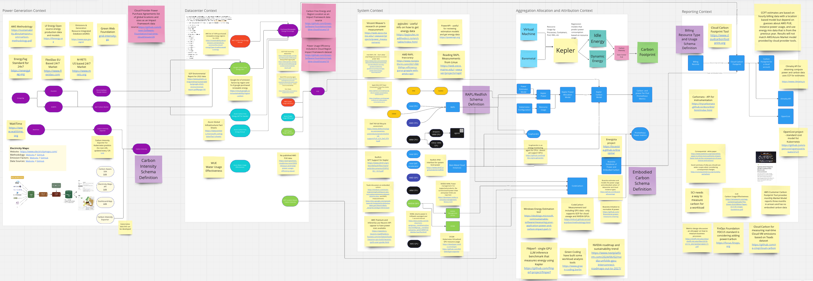

# Real Time Energy and Carbon Standard for Cloud Providers

Cloud providers are the largest purchasers of renewable energy in the world, but so far they have provided their customers with carbon information on a monthly basis, a few months in arrears, so customers have had to produce their own real-time estimates for cloud workloads, using public information that doesn't include those purchases and overestimates carbon footprints. As part of the information technology supply chain, cloud providers need to supply real-time carbon metrics that can be aggregated by workload, allocated and apportioned through the supply chain to satisfy regulations that are in place in the UK and Europe, on the way in California, and emerging elsewhere. Cloud providers build their own custom silicon and systems designs, and optimize them for low power consumption and to reduce the carbon footprint of their supply chain. Using this standard the efficiency benefits combined with the renewable energy purchases of cloud providers can be compared directly to datacenter alternatives for specific workloads.

Many software as a service (SaaS) providers run multi-tenant workloads on cloud providers. To supply their own customers with carbon footprint estimates, the instance level energy and carbon data needs to be allocated and attributed across workloads. The [Kepler project](https://github.com/sustainable-computing-io/kepler) hosted by the Cloud Native Computing Foundation allocates the energy usage of a host node to the active pods and containers running in that node, so that energy and carbon data can be reported for workloads running on Kubernetes. In datacenter deployments Kepler can directly measure energy usage and obtain carbon intensity data from the datacenter operator. Cloud providers block direct access to energy usage metrics as part of their multi-tenant security model, but could safely provide energy data to Kepler via this standard at one minute intervals.

The cloud providers disclose metadata about regions on an annual basis. This data may include Power and Water Usage Effectiveness, carbon free energy percentage, and the location and grid region for each cloud region. This project is gathering and releasing this metadata as a single data source, and lobbying the cloud provders to release data that is aligned across providers. Data on AWS power generation project locations has also been added.

# Motivation
"All models are wrong, some models are useful". The goal of this project is to make the carbon emissions model for cloud based workloads less wrong, by defining a standard mechanism for cloud providers to share more information, and more useful, by having the same data schema for all cloud providers, and to support updates to that data in real time, which could be minute level granularity for energy usage, and hourly or daily granularity for carbon intensity.

# Current Activity
The initial work is focused on collecting and discussing existing information, and a context miro board has been created that is being used to crowdsource relevant information about power and carbon data sources and how they are created and used from end to end. The miro is [publicly readable here](https://miro.com/app/board/uXjVM1o59N4=/?share_link_id=388311040102) and screenshots are stored in this repo. It is proposed that slowly changing reference data will be shared via the [GSF Impact Framework](https://github.com/Green-Software-Foundation/if), and so far this includes Power Usage Efficiency (PUE), Carbon Free Energy, and Power Purchase Agreement location information. There are issues tracking the development of each of these.

# History
This standard was initially proposed as part of a talk by Adrian Cockcroft at QCon London in March 2023, that was updated and presented again at the CNCF Sustainability Week in October 2023. [March slides,](https://github.com/adrianco/slides/blob/master/Cloud%20DevSusOps%20London.pdf) [October slides.](https://github.com/adrianco/slides/blob/master/Cloud%20DevSusOps%20Oct23.pdf) that summarized the currently available carbon footprint information from the three largest cloud providers, AWS, Azure and GCP. These monthly resolution summaries are aimed at audit reporting, and the proposal was that real time data would enable new kinds of reporting, optimization and tools, and that all the cloud providers should provide the same data.

In June 2023 this proposal was [written up as a PRFAQ](https://github.com/Green-Software-Foundation/real-time-cloud/blob/main/PRFAQ%20for%20RealTimeCarbonMetrics.md) and discussed with the GSF Standards Working Group, who decided to recommend that it become a project, which was created by the GSF in July 2023.

A summary of the state of AWS sustainability at the end of 2023 was [written up here](https://adrianco.medium.com/sustainability-talks-and-updates-from-aws-re-invent-2023-969100c46a6a). There were no substantive announcements but renewable energy purchases are continuing to grow. A comparison of the three main cloud providers disclosures for calendar year 2023 was published as a story in [The New Stack](https://thenewstack.io/sustainability-how-did-amazon-azure-google-perform-in-2023/).
